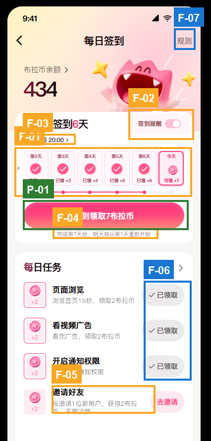

# UX Audit：每日签到

## Executive Summary

页面的核心签到路径已经清楚：连续天数、今日奖励和主按钮能够互相对应，领取7布拉币是明确的首要操作。当前没有发现会直接阻断签到的严重问题。主要风险集中在三个位置：第1天被隐藏后的横滑提示过弱、提醒开关状态辨识度不足、提醒时间与周期规则文字在真实手机上偏小。优先增强这三处，不需要再次改动整体布局。

## Scope & Method

- **目标：** 返回用户确认当前签到进度，领取第7天奖励，并按需设置提醒或完成每日任务。
- **用户与平台：** 返回用户；移动网页，按iOS视觉语境审查。
- **截图：** 1张，daily-check-in.png。
- **方法：** Nielsen、Shneiderman、Gerhardt-Powals、Bastien & Scapin、Fitts、Fogg、Gestalt、Norman、Tognazzini、WCAG 2.1静态子集及内容设计启发式。
- **无法由静态截图判断：** 奖励区域是否真的可以滑动、箭头是否可点击、点击反馈、开关切换反馈、时间选择器、签到加载/失败/防重复提交、通知权限流程、布拉币详情与规则页跳转、实际触控热区、键盘与屏幕阅读器语义、动效、延迟、缩放重排。

## Findings Overview

| ID | 严重度 | 检查项 | 问题 | 依据 |
|---|---|---|---|---|
| F-01 | S2 Minor | FAKE-AFFORDANCE | 第1天被隐藏，但左侧滑动提示过弱 | Norman: Discoverability；Nielsen #6；Fitts’s Law |
| F-02 | S2 Minor | STATE-GAP | 提醒开关的开启状态辨识度不足 | Nielsen #1；Norman: Feedback；WCAG 1.4.11 |
| F-03 | S2 Minor | TOUCH-TARGET | 提醒时间文字与视觉点击目标偏小 | Fitts’s Law；WCAG 2.5.5；Tog: Readability |
| F-04 | S2 Minor | HIERARCHY-FLAT | 第7天后的重置规则过小、过淡 | Content #1/#7；Nielsen #1；Peak-End Rule |
| F-05 | S1 Cosmetic | RECALL-TAX | “新用户”的有效条件与到账时机未在当前层级说明 | Nielsen #10；Content #7 |
| F-06 | S1 Cosmetic | CONTRAST-FAIL | “已领取”状态接近禁用态，文字对比偏弱 | WCAG 1.4.3；B&S: Legibility |
| F-07 | S1 Cosmetic | TOUCH-TARGET | “规则”等边缘入口视觉目标较小 | Fitts’s Law；WCAG 2.5.5 |

## Screen

### F-01｜隐藏的第1天不容易被发现

- **当前问题：** 可见奖励从第2天开始，左侧只出现一个很小的“‹”。静态截图无法确认它是按钮、滑动提示还是装饰。
- **用户影响：** 用户可能误以为签到周期只有第2至第7天，或不知道还能查看第1天；但当前“今天”完整可见，因此不会阻断领取。
- **推荐交互方案：** 保留箭头，但把它做成明确的边缘提示。若可点击，视觉尺寸建议24–28px、透明热区至少44px，并点击后平滑移动一组；若仅提示滑动，则不可表现成按钮。首次进入可短暂显示“左右滑动查看7天奖励”，滚动到最左侧后弱化或隐藏左箭头。
- **优先级：** P1 / S2。先修复发现性，再做装饰调整。
- **依据：** Norman: Discoverability/Signifiers；Nielsen #6；Fitts’s Law。

### F-02｜提醒开关状态不够明确

- **当前问题：** 开关使用浅粉轨道和白色滑块，当前究竟是开启还是关闭，第一眼不够确定。
- **用户影响：** 用户可能重复操作，或者误以为已经设置提醒，影响提醒功能的可信度。
- **推荐交互方案：** 不增加“已关闭”等常驻文案，保持用户确认的固定文字。用更明确的开/关轨道对比和滑块位置表达状态；切换后提供短暂反馈，例如“签到提醒已开启，每天20:00提醒”或“签到提醒已关闭”。静态截图无法确认是否已有反馈，应作为实现与验收项。
- **优先级：** P1 / S2。
- **依据：** Nielsen #1；Norman: Feedback/Mapping；WCAG 1.4.11。

### F-03｜提醒时间可读性和可点性偏弱

- **当前问题：** “提醒时间 20:00 ›”位置合理，但字号小、颜色轻，视觉范围也像普通辅助文字。
- **用户影响：** 用户可能看不清时间，或不知道这一行可以修改；在移动端也容易点不中。
- **推荐交互方案：** 保持当前位置，把字号提升至12–13px、行高16–18px、字重500；保留箭头。整行设置至少44px高的透明点击热区，不需要用额外空白撑大视觉布局。点击后打开时间选择器，修改时间不自动改变开关状态。
- **优先级：** P1 / S2。
- **依据：** Fitts’s Law；WCAG 2.5.5；Tog: Readability；Norman: Signifiers。

### F-04｜周期重置规则容易被忽略

- **当前问题：** “完成第7天后，明天将从第1天重新开始”位于主按钮下方，但字号和对比度都很弱。
- **用户影响：** 用户领取第7天奖励后可能不知道周期如何继续，削弱完成最后一天时应有的闭环感。
- **推荐交互方案：** 保留当前说明，将字号提升到至少11–12px并提高对比度；领取成功后再次在成功反馈中明确告知“本轮签到已完成，明天从第1天重新开始”。静态截图无法确认成功反馈是否已经存在，应作为建议方案。
- **优先级：** P1 / S2。
- **依据：** Content #1 Front-load、#7 Honest microcopy；Nielsen #1；Peak-End Rule。

### F-05｜邀请奖励规则仍缺少边界解释

- **当前问题：** 当前已经说明“每邀请1位新用户，获得2布拉币，不限次数”，这是进步；但“新用户”的有效判定和奖励到账时机在当前页面不可见。
- **用户影响：** 用户发出邀请后可能对“为什么没有到账”产生疑问。
- **推荐交互方案：** 不需要把完整规则塞进任务列表。点击“去邀请”后，在分享前展示简短规则：有效新用户如何判定、什么时候到账、同一用户能否重复计算。若后续页面已经说明，则当前列表无需增加文字。
- **优先级：** P2 / S1。
- **依据：** Nielsen #10；Content #7；G-P #2。

### F-06｜已领取状态接近不可用状态

- **当前问题：** “✓ 已领取”使用浅灰底和灰字，容易与普通禁用按钮混淆；当前对比是否达到标准需用工具实测。
- **用户影响：** 用户能通过勾选和文案理解结果，但扫描任务列表时完成状态不够鲜明。
- **推荐交互方案：** 保留灰色弱化层级和“✓ 已领取”，稍微加深文字与勾选颜色；不要恢复成粉色主按钮，以免暗示仍可点击领取。
- **优先级：** P2 / S1。
- **依据：** WCAG 1.4.3；B&S: Legibility；Nielsen #4。

### F-07｜顶部和次级入口需要验证触控热区

- **当前问题：** “规则”、余额箭头和“全部任务”视觉尺寸较小且靠近边缘。截图不能显示真实热区大小。
- **用户影响：** 如果实现层的热区与文字一样小，用户可能点不中，尤其是单手操作。
- **推荐交互方案：** 保持当前视觉尺寸，但把整个文字与周围区域设为至少44×44px的点击目标；按下时提供明确反馈。余额入口在详情页尚未设计期间，应避免无响应，可暂时给出“详情页暂未开放”的反馈。
- **优先级：** P2 / S1。
- **依据：** Fitts’s Law；WCAG 2.5.5；Nielsen #1。

## Journey-Level Assessment

### Fogg B=MAP

- **Motivation：** 7布拉币奖励、连续6天进度和当天高亮能够维持动机。
- **Ability：** 主任务只需要点击一次大按钮，操作成本低。
- **Prompt：** “签到领取7布拉币”足够明确。主要风险不在主提示，而在横滑历史和提醒设置的次级提示过弱。

### Peak-End

第7天是一个自然的周期终点。当前已有重置说明，但它过轻；成功后再次明确“本轮完成、明天重启”，会让流程获得更完整的结束感。

## What Works

- **P-01：** 主按钮大、位置集中，文案同时说明动作和奖励，符合Fitts’s Law与Content #3。
- **P-02：** “连续签到6天”“今天”“可领+7”和CTA数据一致，符合Nielsen #1。
- **P-03：** 已领取使用勾选+文字，今天使用币图标+文字，状态不是只依赖颜色，符合WCAG 1.4.1。
- **P-04：** 邀请任务已经明确“每位新用户奖励2布拉币、不限次数”，降低了用户对上限的猜测。

## Prioritised Recommendations

1. **先修：** 增强第1天隐藏后的滑动提示；提高提醒开关状态辨识；放大提醒时间并保证44px热区。
2. **随后：** 强化周期重置说明，并在签到成功后形成闭环。
3. **打磨：** 补齐邀请规则入口、改善已领取对比度、验证次级入口热区。

## Framework Coverage

| 框架 | 发现 |
|---|---|
| Nielsen | F-01、F-02、F-04、F-05、F-06、F-07 |
| Shneiderman | F-02、F-04 |
| Gerhardt-Powals | F-05 |
| Bastien & Scapin | F-03、F-06 |
| Fitts’s Law | F-01、F-03、F-07 |
| Fogg B=MAP | 主签到CTA表现良好；次级提示偏弱 |
| Gestalt | F-02、F-03 |
| Norman | F-01、F-02、F-03 |
| Tognazzini | F-03 |
| WCAG 2.1静态子集 | F-02、F-03、F-06、F-07 |
| Content heuristics | F-04、F-05 |

## Sources

Nielsen: nngroup.com/articles/ten-usability-heuristics · Shneiderman: cs.umd.edu/users/ben/goldenrules.html · Gerhardt-Powals: Int. J. HCI (1996) · Bastien & Scapin: INRIA RT-0156 (1993) · Fogg: behaviormodel.org · Norman: jnd.org · Tognazzini: asktog.com/atc/principles-of-interaction-design · WCAG: w3.org/WAI/WCAG21/quickref
